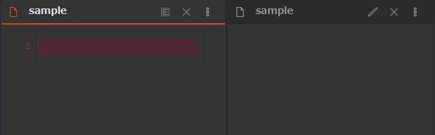
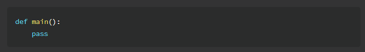
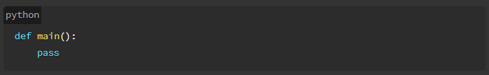
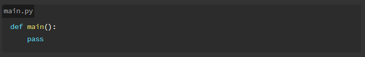
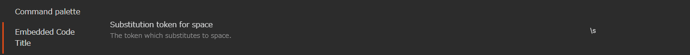
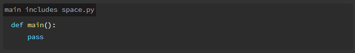

# Obsidian Embedded Code Title Plugin

This is an Obsidian plugin which can embeds title to code blocks.

**⚠ There is a possibility that this plugin doesn't work someday because it depends on the internal DOM structure of Obsidian.**



## 💻Install

For now, I don't have registered community plugins. So you need to install it manually with git and npm.

```
git clone https://github.com/tadashi-aikawa/obsidian-embedded-code-title.git
cd obsidian-embedded-clone-title
npm run build
mkdir -p <your_vault>/.obsidian/obsidian-embedded-clone-title
cp main.js styles.css manifest.json <your_vault>/.obsidian/obsidian-embedded-clone-title/
```

## 🖋 Examples

### No file name

````markdown
```python
def main():
    pass
```
````

↓



### No file name but show a language name

````markdown
```python:
def main():
    pass
```
````

↓



### With a file name

````markdown
```python:main.py
def main():
    pass
```
````

↓



### With a file name includes half spaces

If you configure as the follows.



Then

````markdown
```python:main\sincludes\sspace.py
def main():
    pass
```
````

↓



## 🌍 Use on Obsidian Publish

You can also use it on the published site by Obsidian Publish with `publish/publish.js` and `publish/publish.css`. Please see [my published site](https://minerva.mamansoft.net/Obsidian/Obsidian+Publish%E3%81%AE%E3%82%B5%E3%82%A4%E3%83%88%E3%81%A7%E3%82%B3%E3%83%BC%E3%83%89%E3%83%96%E3%83%AD%E3%83%83%E3%82%AF%E3%81%AB%E3%83%95%E3%82%A1%E3%82%A4%E3%83%AB%E5%90%8D%E3%82%92%E5%9F%8B%E3%82%81%E8%BE%BC%E3%82%80) as examples.

